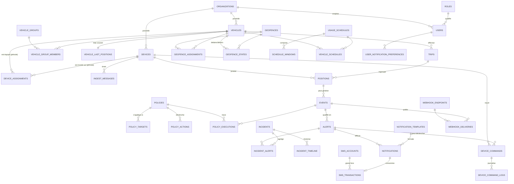

# SISBM CORE — Modélisation de la base de données

**Jalon 1 — Livrable : schéma de base de données**
Stack : AdonisJS 6 (Node.js / TypeScript) · PostgreSQL 16 · PostGIS 3.4 · Redis
Outil de requêtage : DBeaver
Version : 0.1 — à valider par SISBM

---

## 0. Cadrage et principes directeurs

Le TDR impose explicitement d'**éviter la sur-architecture** (§IV.1) et de privilégier
« simplicité, stabilité, maintenabilité, rapidité d'exécution » (§IV.5). Le modèle ci-dessous
respecte quatre règles :

1. **Un monolithe modulaire, une seule base.** Pas de base par module, pas de sharding, pas de
   base time-series séparée. PostgreSQL + PostGIS suffit largement pour la volumétrie du MVP.
2. **On ne modélise que ce qui est dans le périmètre MVP.** Les modules « conducteurs »,
   « maintenance préventive » et « carburant » (Phases 2 et 3) ne sont **pas** créés. En revanche
   le modèle ne leur ferme pas la porte : les points d'accroche naturels sont signalés au §5.
3. **Ce qui est coûteux à retrofitter est posé maintenant.** Trois choses ne se rajoutent pas
   après coup sans migration douloureuse : la clé de tenant, le partitionnement de la table de
   positions, et la séparation `device` / `vehicle`. Elles sont dans le socle.
4. **Le typage privilégie `text` + `CHECK` aux `ENUM` natifs.** Un `ALTER TYPE ... ADD VALUE`
   PostgreSQL ne peut pas s'exécuter dans la même transaction que son utilisation, ce qui casse
   les migrations Lucid. `text` + contrainte `CHECK` s'aligne parfaitement sur les *union types*
   TypeScript et se fait modifier par une simple migration.

### Point de vigilance à arbitrer avec SISBM

> **Mono-tenant ou multi-tenant ?** Le TDR dit que le projet « ne vise pas la construction
> immédiate d'une plateforme SaaS complexe » (§I.3), mais la présentation prévoit la
> **monétisation des notifications SMS**, ce qui suppose des clients facturés. Le modèle retient
> donc une clé `organization_id` sur toutes les tables métier — c'est ~2 jours de travail
> aujourd'hui, contre une réécriture complète du modèle et de tous les contrôles d'accès plus
> tard. Si SISBM confirme un usage strictement interne, on crée une seule organisation et la
> colonne devient inerte : **aucun coût, aucune complexité visible**.

---

## 1. La modélisation

### 1-a. Entités métier et entités relationnelles

#### Entités métier (objets réels, cycle de vie propre)

| Domaine | Entité | Rôle |
|---|---|---|
| Identité | `organizations` | Périmètre de cloisonnement (SISBM et/ou ses clients) |
| Identité | `users` | Comptes de supervision |
| Identité | `roles` | Profils de permissions (RBAC léger) |
| Flotte | `vehicles` | Le véhicule — objet **métier**, indépendant du matériel |
| Flotte | `vehicle_groups` | Regroupement logique (agence, chantier, type) |
| Flotte | `devices` | Le tracker physique (IMEI, SIM, modèle, relais) |
| Télémétrie | `ingest_messages` | Trame brute reçue de Flespi (journal d'ingestion) |
| Télémétrie | `positions` | Point GPS historisé — **table chaude, partitionnée** |
| Télémétrie | `vehicle_last_positions` | Dernier état connu, 1 ligne par véhicule |
| Télémétrie | `trips` | Trajet reconstitué (ignition ON → OFF) |
| Géo | `geofences` | Zone géographique autorisée / interdite / POI |
| Géo | `usage_schedules` | Calendrier d'utilisation autorisée |
| Règles | `policies` | Règle du moteur de politiques |
| Événementiel | `events` | Événement métier normalisé (survitesse, entrée de zone…) |
| Événementiel | `alerts` | Événement qualifié, avec criticité et cycle de traitement |
| Événementiel | `incidents` | Dossier de traitement centralisé |
| Diffusion | `notifications` | Envoi unitaire sur un canal |
| Diffusion | `notification_templates` | Gabarits de message |
| Sécurité | `device_commands` | Commande vers le tracker, dont l'**immobilisation** |
| Facturation | `sms_accounts` | Solde de crédits SMS |
| Facturation | `sms_transactions` | Grand livre append-only des mouvements |
| Intégration | `api_clients`, `webhook_endpoints` | Ouverture ERP / logistique / SIEM |
| Exploitation | `report_jobs` | Génération asynchrone PDF / Excel |
| Traçabilité | `audit_logs` | Journal d'audit append-only |

#### Entités relationnelles (tables d'association)

| Table | Cardinalité | Ce qu'elle porte en propre |
|---|---|---|
| `device_assignments` | `devices` N—N `vehicles` **dans le temps** | `period` (`tstzrange`), installateur, notes |
| `vehicle_group_members` | `vehicles` N—N `vehicle_groups` | date d'entrée |
| `geofence_assignments` | `geofences` N—N `vehicles`/`vehicle_groups` | `on_enter`, `on_exit`, horaires applicables |
| `geofence_states` | état courant `vehicle` × `geofence` | `is_inside`, `since` — indispensable pour détecter les **transitions** |
| `vehicle_schedules` | `vehicles` N—N `usage_schedules` | `mode` (`allowed` / `forbidden`) |
| `schedule_windows` | composition de `usage_schedules` | jour, heure début, heure fin |
| `policy_targets` | `policies` N—N véhicules/groupes | portée de la règle |
| `policy_actions` | composition de `policies` | type d'action, config, ordre |
| `incident_alerts` | `incidents` N—N `alerts` | rattachement d'alertes à un dossier |
| `role_permissions` | *(intégré dans `roles.permissions text[]`)* | RBAC volontairement plat pour le MVP |
| `user_notification_preferences` | `users` N—N canaux | seuil de criticité, canal actif |

**Trois décisions structurantes à retenir :**

**① `device` ≠ `vehicle`.** Un tracker est démonté, réparé, remonté sur un autre véhicule. Si
l'IMEI est une colonne de `vehicles`, tout l'historique bascule sur le mauvais véhicule le jour
du changement. `device_assignments` porte la relation **datée**, avec une contrainte
d'exclusion garantissant qu'un tracker n'est jamais sur deux véhicules à la fois, ni un véhicule
équipé de deux trackers sur la même période.

**② `event` ≠ `alert` ≠ `incident`.** Le TDR mêle les trois. Ce sont trois niveaux distincts :
- `event` = **fait brut normalisé** (« survitesse à 14h32, 112 km/h »), immuable, jamais modifié.
- `alert` = **fait qualifié par une politique**, avec criticité et cycle `new → acknowledged → resolved`.
- `incident` = **dossier de traitement**, qui peut agréger plusieurs alertes et vivre plusieurs jours.

Sans cette séparation, on ne peut ni faire du *dédoublonnage* (100 positions en survitesse
d'affilée = 1 alerte, pas 100), ni de l'escalade, ni des statistiques propres.

**③ `positions` est isolée du reste.** C'est la seule table à très forte volumétrie
(cf. §1-d). Elle est partitionnée, elle n'a pas de clé étrangère `ON DELETE CASCADE` vers le
reste, et rien ne lui fait de `UPDATE`.

---

### 1-b. Contraintes métier, contraintes relationnelles et cycles de vie

#### Contraintes métier critiques

| # | Règle | Où elle est appliquée |
|---|---|---|
| CM-01 | Un tracker ne peut être affecté qu'à un seul véhicule à un instant T | `EXCLUDE USING gist (device_id WITH =, period WITH &&)` |
| CM-02 | Un véhicule ne porte qu'un seul tracker actif à un instant T | `EXCLUDE USING gist (vehicle_id WITH =, period WITH &&)` |
| CM-03 | Une immatriculation est unique par organisation (hors archivés) | Index unique partiel `WHERE deleted_at IS NULL` |
| CM-04 | Un IMEI est globalement unique | `UNIQUE (imei)` |
| CM-05 | Une vitesse est positive, un cap est dans `[0, 360[` | `CHECK` sur `positions` |
| CM-06 | Un trajet ouvert au maximum par véhicule | Index unique partiel `WHERE status = 'open'` |
| CM-07 | **Pas de coupure moteur au-dessus du seuil de vitesse** | `CHECK` sur `device_commands` **+** contrôle applicatif **+** validation |
| CM-08 | Une commande d'immobilisation exige un `reason` non vide et un demandeur identifié | `NOT NULL` + `CHECK (length(trim(reason)) > 0)` |
| CM-09 | Une seule commande en vol par device | Index unique partiel sur statuts non terminaux |
| CM-10 | Le solde SMS ne peut pas devenir négatif | `CHECK (balance_credits >= 0)` + verrou de ligne |
| CM-11 | Le grand livre SMS est append-only et chaîné (`balance_after`) | Absence de droit `UPDATE`/`DELETE` pour le rôle applicatif |
| CM-12 | Une fenêtre horaire a une fin strictement après son début | `CHECK (start_time < end_time)` |
| CM-13 | Une affectation de geofence cible un véhicule **ou** un groupe, jamais les deux | `CHECK (num_nonnulls(vehicle_id, vehicle_group_id) = 1)` |
| CM-14 | Toute géométrie est en SRID 4326 | Typage `geography(...,4326)` |
| CM-15 | Un événement est unique par `dedup_key` | `UNIQUE (dedup_key)` — idempotence du moteur de règles |
| CM-16 | Une position est unique par `(device_id, recorded_at)` | Clé d'idempotence du **Store & Forward** |

> **CM-16 est la contrainte la plus rentable du modèle.** Le Store & Forward rejoue les trames
> mémorisées par le tracker après une zone blanche. Sans clé d'unicité naturelle, chaque
> resynchronisation duplique l'historique et fausse tous les kilométrages. Avec elle, un
> `INSERT ... ON CONFLICT DO NOTHING` rend le réingestion parfaitement idempotente.

#### Cycles de vie

```
vehicle       : draft → active → maintenance → inactive → archived (soft delete)
device        : stock → active → maintenance → decommissioned
trip          : open → closed  (+ 'orphan' si fermé par timeout sans ignition OFF)
alert         : new → acknowledged → resolved → closed
                     ↘ false_positive
incident      : open → in_progress → resolved → closed
notification  : queued → sending → sent → delivered
                              ↘ failed (retry) ↘ cancelled
device_command: pending_validation → approved → queued → sent → acknowledged
                     ↘ rejected        ↘ expired      ↘ failed  ↘ cancelled
report_job    : queued → running → completed | failed | expired
```

**Suppression :** *soft delete* (`deleted_at`) pour `vehicles`, `users`, `geofences`, `policies` —
ces objets sont référencés par des données historiques qui doivent rester lisibles.
*Hard delete* interdit sur `positions`, `events`, `audit_logs`, `sms_transactions` : seule la
**purge par rétention** (drop de partition) les supprime.

---

### 1-c. OLTP et OLAP

> **Note terminologique :** dans le plan initial les deux acronymes sont intervertis.
> **OLTP** = *OnLine **Transaction** Processing* (écritures unitaires, temps réel).
> **OLAP** = *OnLine **Analytical** Processing* (agrégations, rapports, KPI).
> La distinction compte ici, car les deux charges ont des besoins opposés.

#### Charge OLTP (chemin chaud)

| Opération | Fréquence estimée | Exigence |
|---|---|---|
| `INSERT` position depuis Flespi | ~1 / 10-30 s / véhicule | latence < 50 ms, idempotent |
| `UPSERT` `vehicle_last_positions` | idem | 1 ligne, très fréquente |
| Évaluation moteur de règles | à chaque position | lectures indexées uniquement |
| `INSERT` event / alert | rare (quelques % des positions) | transactionnel |
| `INSERT` notification + débit SMS | rare | **atomique** (cf. §2) |
| `INSERT` `device_commands` | très rare | **sérialisable** (cf. §2-c) |
| Lecture carte temps réel | par utilisateur connecté | servie par `vehicle_last_positions`, jamais par `positions` |

**Volumétrie de référence** — 100 véhicules, 1 point / 15 s, 10 h d'activité/jour :
≈ **240 000 positions/jour**, ≈ **7,2 M/mois**, ≈ **86 M/an**.
À ~250 octets/ligne + index : ordre de grandeur **35–45 Go/an**. C'est précisément le seuil à
partir duquel un partitionnement mensuel cesse d'être du luxe.

#### Charge OLAP (chemin froid)

| Besoin | Source |
|---|---|
| Rapports trajets / km parcourus | `trips` (pré-agrégé, pas `positions`) |
| Rapports alertes et événements flotte | `events`, `alerts` |
| Tableaux de bord KPI | **vues matérialisées** rafraîchies périodiquement |
| Consommations SMS | `sms_transactions` |
| Relecture (*replay*) d'un trajet | `positions` filtrée par `(vehicle_id, recorded_at)` sur une partition |

#### Stratégie de séparation — sans base analytique séparée

1. **`trips` est la table de pré-agrégation.** Distance, durée, vitesse max et moyenne sont
   calculées **une fois**, à la clôture du trajet. Un rapport mensuel lit quelques centaines de
   lignes de `trips` au lieu de scanner des millions de positions.
2. **`vehicle_last_positions` absorbe le temps réel.** La carte de supervision fait un `SELECT`
   sur une table de N lignes (N = nombre de véhicules), jamais un `DISTINCT ON` sur `positions`.
3. **Vues matérialisées** pour les KPI journaliers, rafraîchies en `CONCURRENTLY` la nuit.
4. **Partitionnement mensuel de `positions`** → le *partition pruning* transforme
   « les trajets de mars » en scan d'une seule partition.
5. **Rapports lourds en asynchrone** via `report_jobs`, hors requête HTTP.
6. Si un jour la charge analytique gêne la production : **réplica en lecture** PostgreSQL et
   routage des rapports dessus. Zéro changement de modèle. C'est le plan B, pas le plan A.

---

### 1-d. MCD — Modèle conceptuel de données

#### Vue d'ensemble



#### Typage — conventions retenues

| Nature | Type PostgreSQL | Justification |
|---|---|---|
| Identifiant métier | `uuid` (`gen_random_uuid()`) | Exposable en API, généré côté applicatif, pas de fuite de volumétrie |
| Identifiant de table chaude | `bigint` `GENERATED ALWAYS AS IDENTITY` | `positions`, `ingest_messages`, `audit_logs` : 8 octets ≪ 16, index plus compacts |
| Horodatage | `timestamptz` | **Jamais `timestamp`.** Stockage UTC, conversion Africa/Abidjan à l'affichage |
| Point GPS | `geography(Point, 4326)` | Calculs de distance en mètres, corrects sur le globe |
| Zone | `geography(MultiPolygon, 4326)` | Un cercle est stocké comme polygone bufferisé (`center` + `radius_m` conservés pour l'édition) |
| Tracé de trajet | `geography(LineString, 4326)` | Relecture sans relire toutes les positions |
| Vitesse / distance | `numeric(6,2)` / `numeric(10,2)` | **Pas de `float`** sur des grandeurs facturables ou comparées à un seuil |
| Montant | `numeric(14,4)` | Idem, jamais de flottant sur de l'argent |
| Statut, type | `text` + `CHECK (... IN (...))` | Évolutif par simple migration, s'aligne sur les union types TS |
| Charge utile variable | `jsonb` | Trame Flespi brute, conditions de politique, contexte d'alerte |
| E-mail | `citext` | Unicité insensible à la casse sans `lower()` partout |
| Liste courte | `text[]` | Permissions, types d'événements d'un webhook |
| Période d'affectation | `tstzrange` | Rend possible la contrainte d'exclusion CM-01/CM-02 |

#### Nommage

- Tables : **pluriel, `snake_case`** → `vehicles`, `device_commands`
- Clés étrangères : `<singulier>_id` → `vehicle_id`
- Booléens : préfixe `is_` / `has_` → `is_active`, `has_relay`
- Dates : suffixe `_at` (instant) ou `_on` (date) → `created_at`, `acknowledged_at`
- Unités **dans le nom** → `speed_kph`, `distance_m`, `radius_m`, `duration_s`
  *(règle non négociable : c'est ce qui évite les bugs d'unité en production)*
- Index : `idx_<table>_<colonnes>` · Unique : `uq_<table>_<colonnes>` · Check : `ck_<table>_<règle>`

---

## 2. Le système ACID

C'est effectivement le point le plus sensible du projet : une plateforme qui **coupe un moteur**
et qui **facture des SMS** ne peut pas se permettre d'états incohérents.

### 2-a. Atomicité

**Trois transactions critiques.**

**① Ingestion d'une position** — la trame, la position, l'événement et l'alerte doivent apparaître
ensemble ou pas du tout :

```
BEGIN;
  INSERT INTO ingest_messages ... ON CONFLICT (source, external_id) DO NOTHING;
  INSERT INTO positions ... ON CONFLICT (device_id, recorded_at) DO NOTHING;
  UPDATE vehicle_last_positions ... (UPSERT);
  INSERT INTO events ... ON CONFLICT (dedup_key) DO NOTHING;
  INSERT INTO alerts ...;
  INSERT INTO outbox_messages ...;   -- ← notifications et webhooks
COMMIT;
```

**Pattern Transactional Outbox.** Un envoi SMS ou un appel webhook **ne doit jamais être fait à
l'intérieur d'une transaction SQL** : si le COMMIT échoue après l'envoi, le client reçoit une
alerte pour un événement qui n'existe pas en base ; si l'appel réseau prend 3 secondes, il
maintient la transaction ouverte et bloque l'ingestion. On écrit donc l'intention d'envoi dans
`outbox_messages` **dans la même transaction**, et un worker Redis la dépile ensuite. C'est le
seul moyen d'obtenir « l'alerte existe ⟺ la notification part » sans transaction distribuée.

**② Débit de crédits SMS** — la notification et le débit sont indissociables :

```
BEGIN;
  SELECT balance_credits FROM sms_accounts WHERE id = $1 FOR UPDATE;   -- ← verrou de ligne
  -- contrôle applicatif : solde suffisant ?
  UPDATE sms_accounts SET balance_credits = balance_credits - $2 ...;
  INSERT INTO sms_transactions (type='consumption', quantity, balance_after, notification_id ...);
  UPDATE notifications SET status = 'queued' ...;
COMMIT;
```
Le `SELECT ... FOR UPDATE` sérialise les débits concurrents sur le même compte. Sans lui, deux
alertes simultanées lisent le même solde et le compte passe en négatif.

**③ Commande d'immobilisation** — voir §2-c.

**Idempotence.** Chaque écriture externe porte une clé naturelle : `ingest_messages.external_id`,
`positions (device_id, recorded_at)`, `events.dedup_key`, `notifications.dedup_key`. Un rejeu
Flespi ou un retry de worker ne produit aucun doublon. C'est ce qui rend le Store & Forward sûr.

### 2-b. Cohérence

| Niveau | Mécanisme |
|---|---|
| Référentiel | `FOREIGN KEY` systématiques. `ON DELETE RESTRICT` par défaut ; `CASCADE` uniquement sur les compositions (`schedule_windows`, `policy_actions`, `incident_timeline`) |
| Domaine | `CHECK` sur toutes les grandeurs physiques et tous les statuts |
| Unicité | Index uniques, dont **partiels** (`WHERE deleted_at IS NULL`, `WHERE status = 'open'`) |
| Temporel | `EXCLUDE USING gist` sur `device_assignments` — impossible à contourner, même par un bug applicatif |
| Spatial | Typage `geography(...,4326)` + `CHECK (ST_IsValid(...))` sur les geofences |
| Comptable | `sms_transactions.balance_after` chaîné, rapprochable à tout moment avec `sms_accounts.balance_credits` |
| Transition d'état | Machines à états **applicatives** (services AdonisJS), tracées dans `device_command_logs` et `audit_logs` |

**Choix assumé : pas de triggers métier.** Les triggers PostgreSQL sont invisibles depuis le code
et rendent le système opaque pour un développeur qui reprend le projet — ce qui contredit
frontalement l'exigence §IV.2 du TDR (réduction de la dépendance technique). Les règles métier
vivent dans des services TypeScript testables. **Exception :** un unique trigger `updated_at`,
purement technique, et le refus de droits `UPDATE`/`DELETE` sur les tables append-only.

### 2-c. Isolation

| Charge | Niveau | Motif |
|---|---|---|
| Ingestion de positions | `READ COMMITTED` (défaut) | Inserts indépendants, pas de lecture-modification |
| Lectures API / carte | `READ COMMITTED` | Aucune anomalie gênante à ce niveau |
| Débit SMS | `READ COMMITTED` + `SELECT FOR UPDATE` | Verrou pessimiste ciblé, plus simple et plus rapide qu'un `SERIALIZABLE` global |
| Clôture de trajet | `READ COMMITTED` + `pg_advisory_xact_lock(vehicle_id)` | Empêche deux workers de clore le même trajet |
| **Commande d'immobilisation** | **`SERIALIZABLE`** | Charge quasi nulle, enjeu maximal. Le coût du niveau le plus strict est négligeable, celui d'une double coupure ne l'est pas |
| Rafraîchissement des vues KPI | `REFRESH ... CONCURRENTLY` | Ne bloque pas les lecteurs |

**Anomalies explicitement traitées :**
- *Lost update* sur le solde SMS → `FOR UPDATE` (2-a ②).
- *Write skew* sur les commandes (deux opérateurs approuvent la même coupure en parallèle) →
  `SERIALIZABLE` **+** index unique partiel CM-09. Les deux, parce qu'un `SERIALIZABLE` peut
  échouer et être rejoué, alors que la contrainte d'unicité, elle, est absolue.
- *Phantom read* sur les geofences → non bloquant, la réévaluation suivante corrige.

**Règle d'exploitation :** aucune transaction applicative ne dépasse **5 secondes**
(`statement_timeout = 5s` sur le rôle applicatif, `30s` sur le rôle rapports). Une transaction
longue sur `positions` fait exploser la table par accumulation de tuples morts.

### 2-d. Durabilité

| Mesure | Réglage |
|---|---|
| WAL | `wal_level = replica`, `synchronous_commit = on` sur la base principale |
| Sauvegarde logique | `pg_dump` quotidien chiffré, rétention 30 jours, **hors du serveur de production** |
| Sauvegarde physique / PITR | `pg_basebackup` hebdomadaire + archivage WAL continu |
| Test de restauration | **Mensuel, obligatoire.** Une sauvegarde jamais restaurée n'est pas une sauvegarde |
| Réplication | Réplica en *streaming* asynchrone — recommandé dès la mise en production (Jalon 4) |
| Rétention `positions` | 24 mois en ligne, puis `DETACH PARTITION` + export Parquet/CSV archivé |
| Rétention `ingest_messages` | 30 jours (journal technique de rejeu uniquement) |
| Rétention `audit_logs`, `sms_transactions` | **Illimitée** — valeur probante |
| Objectifs | **RPO ≤ 15 min** (archivage WAL) · **RTO ≤ 4 h** (procédure documentée au Jalon 4) |

**Nuance importante :** la durabilité au sens PostgreSQL commence au COMMIT. En amont, la
durabilité repose sur la **mémoire du tracker et le tampon Flespi** (Store & Forward). Le rôle de
la base est de garantir que tout ce qui arrive est ingéré **exactement une fois** — c'est le rôle
de la clé d'idempotence CM-16, et c'est pour cela que `ingest_messages` conserve la trame brute
30 jours : en cas de bug du parseur, on rejoue.

---

## 3. Portes ouvertes vers les phases 2 et 3

Aucune table n'est créée pour ces modules, mais les points d'accroche existent :

| Module futur | Accroche prévue |
|---|---|
| Gestion des conducteurs (P2) | `trips.driver_id` et `events.driver_id` → colonnes nullables à ajouter, plus une table `drivers` et `driver_assignments` sur le modèle de `device_assignments` |
| Maintenance préventive (P2) | `vehicles.odometer_km` déjà présent et alimenté par la clôture des trajets ; il ne restera qu'à ajouter `maintenance_plans` et `maintenance_operations` |
| Carburant (P3) | `positions.raw` (jsonb) conserve déjà les champs capteurs non exploités des trames Flespi — les données passées seront réexploitables |
| Connecteurs ERP / SIEM dédiés (P2+) | `webhook_endpoints` + `outbox_messages` sont génériques ; un connecteur n'est qu'un consommateur de plus |

---

## 4. Ce qui reste à valider avec SISBM

1. **Mono-tenant ou multi-tenant** (cf. §0) — impact structurel, à trancher avant le Jalon 2.
2. **Fréquence d'émission des trackers** (5 s / 15 s / 30 s / à l'événement) — dimensionne toute
   la volumétrie et le coût d'hébergement.
3. **Taille de flotte cible à 12 et 24 mois.**
4. **Seuil de vitesse d'autorisation de coupure moteur** (proposition : 5 km/h) et **circuit de
   validation** : validation humaine systématique, ou conditions cumulatives automatiques ?
5. **Durée de rétention légale** des positions et des journaux d'audit.
6. **Matrice des rôles et permissions** — à figer pour le Jalon 2.
7. **Fuseau horaire de référence** pour les rapports et les fenêtres horaires (proposition :
   `Africa/Abidjan`, stockage UTC).
